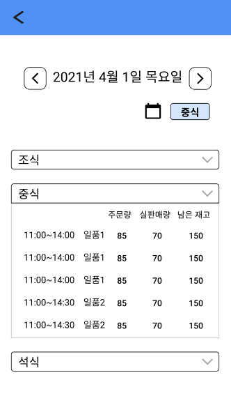

# 식당 담당자

## 0. 진입 화면

`Initial design`
|UI|Analysis|
|--|--|
| |- 현재 시간 판매중인 식사 때가 언제인 지 명시해야함.   - 메뉴 관리에서 판매 현황 조회와 메뉴 상태 관리 두 가지 기능을 제공함.   판매 중 빠르게 확인이 가능해야하므로 나누는 것이 적합함.|

`Re-design`

## 1. QR코드 인식

`Initial design`
|UI|Analysis|
|--|--|
| |- 인식 화면이 디바이스에서 켜져있어야 하므로 화면유지, 터치 제한기능이 필요함   - 가로로 디바이스를 위치해야하는 경우를 고려해 카메라 전환기능이 필요함.   - 점원이 직접 코드를 인식하지 않아 인력을 아낄 수 있음.|

`Re-design`

 
 

## 2. 메뉴 상태 관리

- 판매 메뉴에 대한 최대 판매 수량(인분) 등록
- 판매 메뉴 비활성화(품절, 판매 중지 등)

`Initial design`
|UI|Analysis|
|--|--|
| |- 한 식당에 메뉴마다 판매 시간이 다른 경우가 존재하므로 시간을 메뉴마다 적어야함.   - 판매상태, 재고 준비량을 중복해서 적을 필요가 없음.   다른 날짜를 보려면 계속 버튼을 눌러야해서 불편하므로 캘린더로 날짜를 선택할 수 있도록 함.|

`Re-design`

 

## 3. 판매 현황 조회

`Initial design`
|UI|Analysis|
|--|--|
| |- 현재 메뉴 주문 내역과 실제 음식 수령 내역을 확인   - 판매 메뉴에 대한 최대 판매 수량   - 주문 현황을 보고 바로 메뉴를 비활성화할 수 있도록 버튼을 추가해야함|

`Redesign`

---
 

# 전체 학식당 관리자

## 0. 진입 화면

`Initial design`
|UI|Analysis|
|--|--|
| |- 거래 트랜젝션, 통계 자료, 리뷰 관리의 총 세 가지 기능을 제공함.   - 서비스 권한의 안정성을 보장하기 위하여 자동 로그인이 지속되는 경우를 방지해야함.   그러므로 실제 학식 전체 관리자가 이용 중일 때 30분 마다 로그인을 연장해서 사용하도록 기능을 추가함. (ex. 은행 서비스의 공공인증서 로그인 연장) |

`Re-design`

## 1. 거래 트랜젝션 보기

`Initial design`
|UI|Analysis|
|--|--|
| 
  
 | - 서비스 권한의 안정성을 보장하기 위하여 자동 로그인이 지속되는 경우를 방지해야함.   - 다른 날짜를 보려면 계속 버튼을 눌러야해서 불편하므로 캘린더로 날짜를 선택할 수 있도록 함.   판매시간, 메뉴, 거래종류, 수량, total에 대한 트랜젝션을 확인하기 편하도록 표로 나타내주어야 함.   이 때 __거래종류__ 와 __최신 순/오래된 순__ 에 따라도 표가 재정렬 되도록 탭바를 추가함. |

`Re-design`

## 2. 통계 자료 보기

- 인기 상위 메뉴
- 수익률 상위 메뉴

`Initial design`
|UI|Analysis|
|--|--|
| 
 
|- 서비스 권한의 안정성을 보장하기 위하여 자동 로그인이 지속되는 경우를 방지해야함.   - '냠냠굿' 자체 알고리즘으로 계산한 인기 메뉴와, 수익률 높은 메류를 나타냄   서비스의 신뢰를 위해 '냠냠굿' 기준 인기 메뉴와 수익률 높은 메뉴에 대한 설명을 추가함.   - 특정 기간에 대한 통계를 제공하기 위해 1주일, 1개월, 3개월, 6개월, 1년 단위의 기간을 선택할 수 있도록 탭바를 추가함. |

`Re-design`

 
